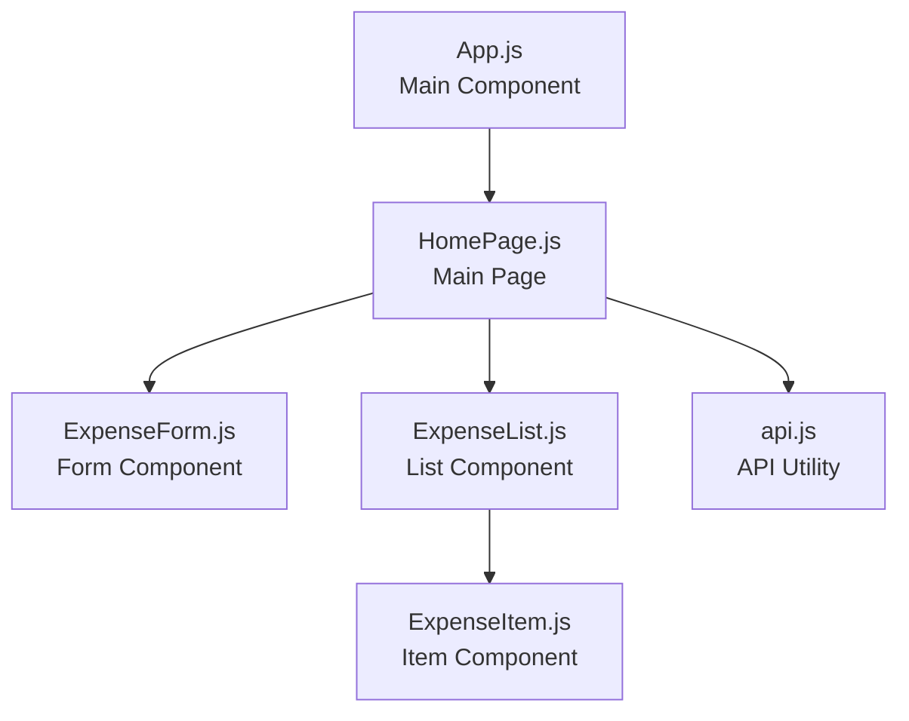

# System Architecture & Function Map

```mermaid
graph TD
    A["App.js<br/>Main Component"]
    B["HomePage.js<br/>Main Page"]
    C["ExpenseForm.js<br/>Form Component"]
    D["ExpenseList.js<br/>List Component"]
    E["ExpenseItem.js<br/>Item Component"]
    F["api.js<br/>API Utility"]

    A --> B
    B --> C
    B --> D
    D --> E
    B --> F

    click A "client/src/App.js#L1" "Open App.js"
    click B "client/src/pages/HomePage.js#L1" "Open HomePage.js"
    click C "client/src/components/ExpenseForm.js#L1" "Open ExpenseForm.js"
    click D "client/src/components/ExpenseList.js#L1" "Open ExpenseList.js"
    click E "client/src/components/ExpenseItem.js#L1" "Open ExpenseItem.js"
    click F "client/src/utils/api.js#L1" "Open api.js"
```