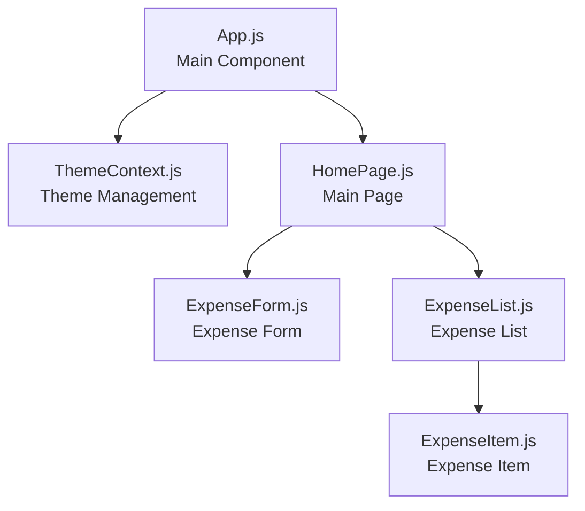

# System Architecture & Function Map

```mermaid
graph TD
    A["App.js<br/>Main Component"]
    B["ThemeContext.js<br/>Theme Management"]
    C["HomePage.js<br/>Main Page"]
    D["ExpenseForm.js<br/>Expense Form"]
    E["ExpenseList.js<br/>Expense List"]
    F["ExpenseItem.js<br/>Expense Item"]

    A --> B
    A --> C
    C --> D
    C --> E
    E --> F

    click A "App.js#L1" "Open App.js"
    click B "ThemeContext.js#L1" "Open ThemeContext.js"
    click C "HomePage.js#L1" "Open HomePage.js"
    click D "ExpenseForm.js#L1" "Open ExpenseForm.js"
    click E "ExpenseList.js#L1" "Open ExpenseList.js"
    click F "ExpenseItem.js#L1" "Open ExpenseItem.js"
```