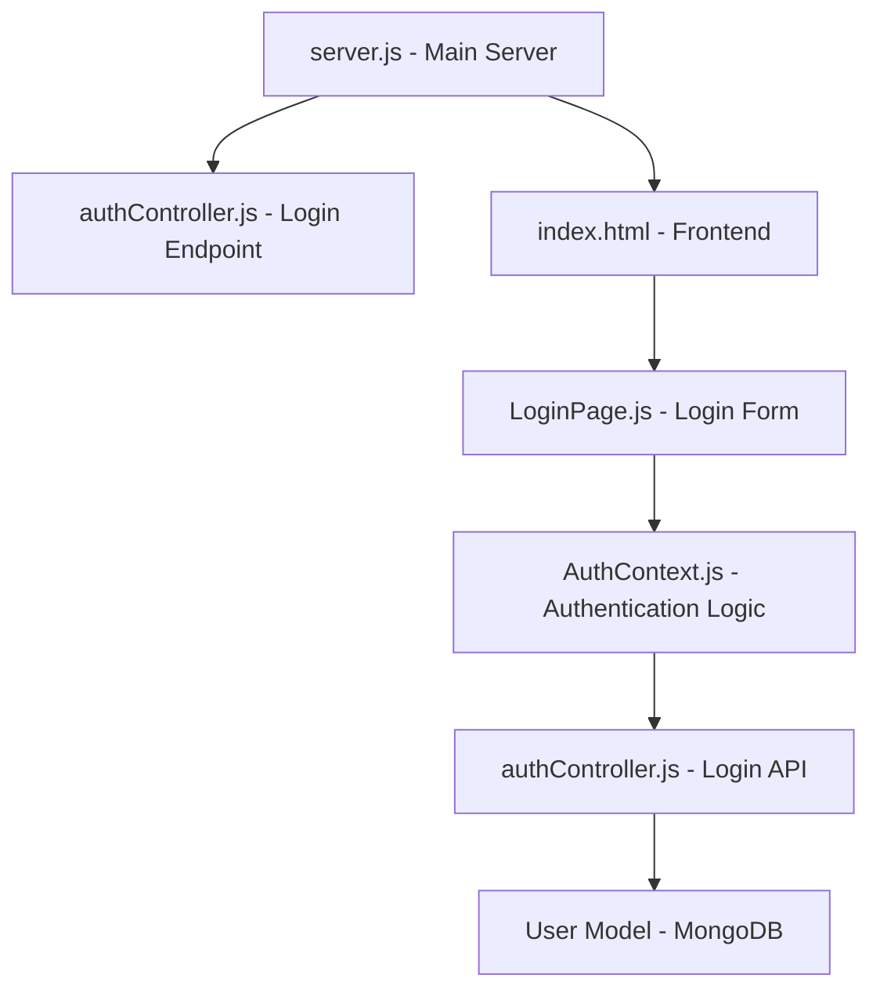

# System Architecture & Function Map

```mermaid
graph TD
    A["server.js - Main Server"] --> B["authController.js - Login Endpoint"]
    A --> C["index.html - Frontend"]
    C --> D["LoginPage.js - Login Form"]
    D --> E["AuthContext.js - Authentication Logic"]
    E --> F["authController.js - Login API"]
    F --> G["User Model - MongoDB"]
    click A "server.js#L1" "Open server.js"
    click B "authController.js#L1" "Open authController.js"
    click C "index.html#L1" "Open index.html"
    click D "LoginPage.js#L1" "Open LoginPage.js"
    click E "AuthContext.js#L1" "Open AuthContext.js"
```