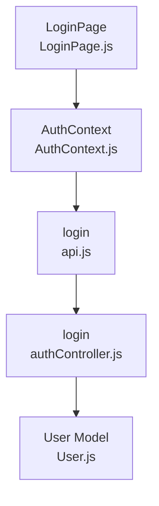

# System Architecture & Function Map

```mermaid
graph TD
    A["LoginPage<br/>LoginPage.js"]
    B["AuthContext<br/>AuthContext.js"]
    C["login<br/>api.js"]
    D["login<br/>authController.js"]
    E["User Model<br/>User.js"]

    A --> B
    B --> C
    C --> D
    D --> E

    click A "client/src/pages/LoginPage.js#L1" "Open LoginPage.js"
    click B "client/src/context/AuthContext.js#L1" "Open AuthContext.js"
    click C "client/src/utils/api.js#L1" "Open api.js"
    click D "controllers/authController.js#L1" "Open authController.js"
    click E "models/User.js#L1" "Open User.js"
```