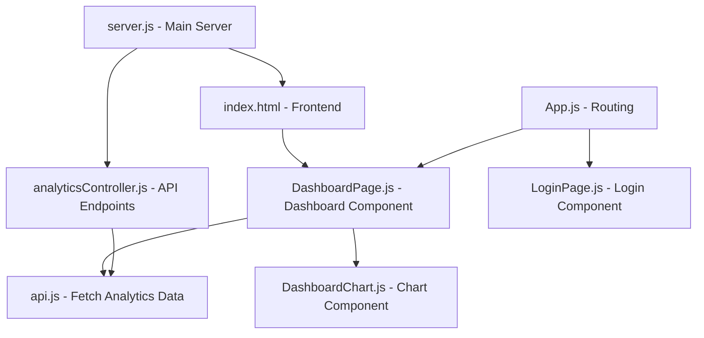

# System Architecture & Function Map

```mermaid
graph TD
    A["server.js - Main Server"] --> B["analyticsController.js - API Endpoints"]
    A --> C["index.html - Frontend"]
    C --> D["DashboardPage.js - Dashboard Component"]
    D --> E["DashboardChart.js - Chart Component"]
    D --> F["api.js - Fetch Analytics Data"]
    B --> F
    G["App.js - Routing"] --> D
    G --> H["LoginPage.js - Login Component"]
    click A "server.js#L1" "Open server.js"
    click B "analyticsController.js#L1" "Open analyticsController.js"
    click C "index.html#L1" "Open index.html"
    click D "DashboardPage.js#L1" "Open DashboardPage.js"
    click E "DashboardChart.js#L1" "Open DashboardChart.js"
    click F "api.js#L1" "Open api.js"
    click G "App.js#L1" "Open App.js"
    click H "LoginPage.js#L1" "Open LoginPage.js"
```