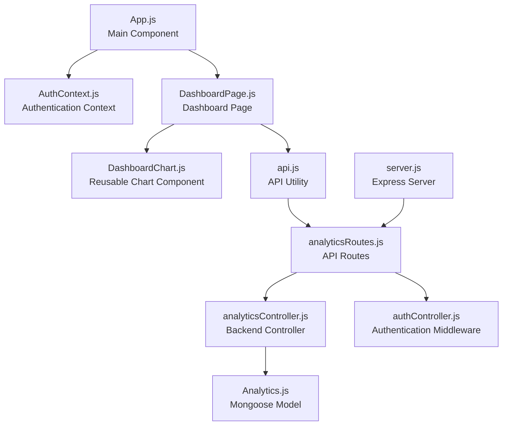

# System Architecture & Function Map

```mermaid
graph TD
    A["App.js<br/>Main Component"]
    B["AuthContext.js<br/>Authentication Context"]
    C["DashboardPage.js<br/>Dashboard Page"]
    D["DashboardChart.js<br/>Reusable Chart Component"]
    E["api.js<br/>API Utility"]
    F["analyticsController.js<br/>Backend Controller"]
    G["Analytics.js<br/>Mongoose Model"]
    H["authController.js<br/>Authentication Middleware"]
    I["analyticsRoutes.js<br/>API Routes"]
    J["server.js<br/>Express Server"]

    A --> B
    A --> C
    C --> E
    C --> D
    E --> I
    I --> H
    I --> F
    F --> G
    J --> I

    click A "App.js#L1" "Open App.js"
    click B "AuthContext.js#L1" "Open AuthContext.js"
    click C "pages/DashboardPage.js#L1" "Open DashboardPage.js"
    click D "components/DashboardChart.js#L1" "Open DashboardChart.js"
    click E "utils/api.js#L1" "Open api.js"
    click F "controllers/analyticsController.js#L1" "Open analyticsController.js"
    click G "models/Analytics.js#L1" "Open Analytics.js"
    click H "controllers/authController.js#L1" "Open authController.js"
    click I "routes/analyticsRoutes.js#L1" "Open analyticsRoutes.js"
    click J "server.js#L1" "Open server.js"
```