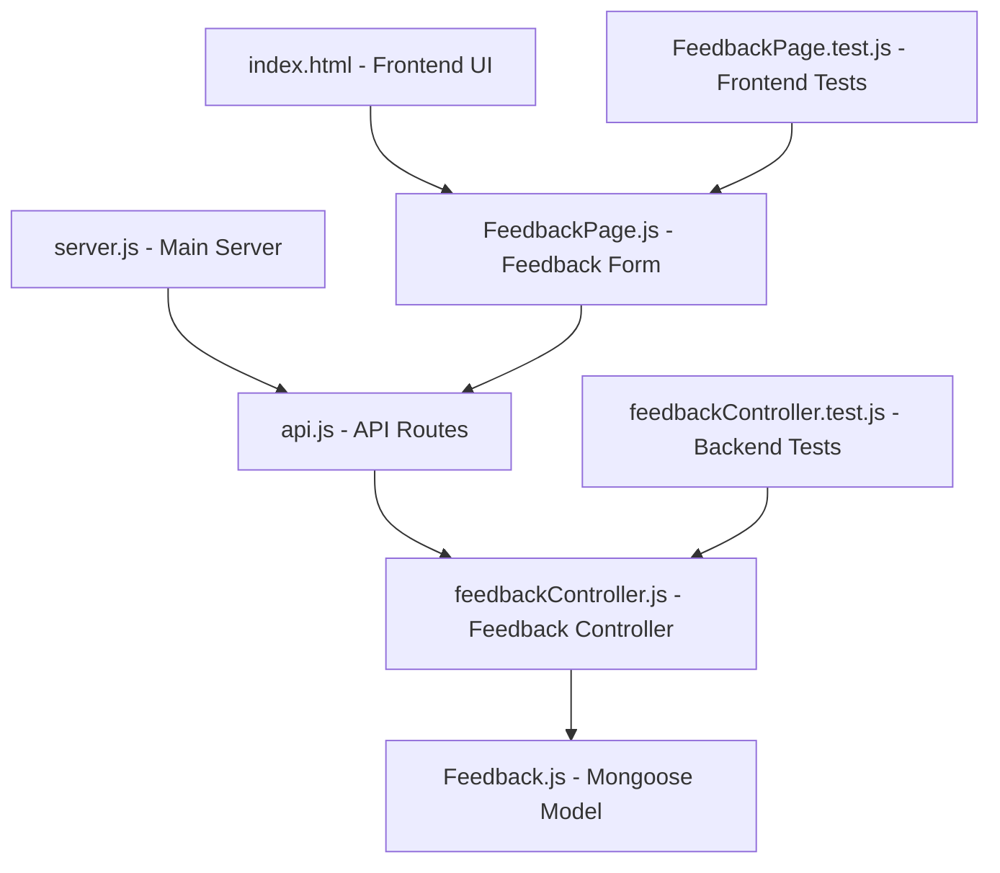

# System Architecture & Function Map

```mermaid
graph TD
    A["server.js - Main Server"]
    B["api.js - API Routes"]
    C["feedbackController.js - Feedback Controller"]
    D["Feedback.js - Mongoose Model"]
    E["index.html - Frontend UI"]
    F["feedbackController.test.js - Backend Tests"]
    G["FeedbackPage.js - Feedback Form"]
    H["FeedbackPage.test.js - Frontend Tests"]

    A --> B
    B --> C
    C --> D
    E --> G
    G --> B
    F --> C
    H --> G

    click A "server.js#L1" "Open server.js"
    click B "api.js#L1" "Open api.js"
    click C "feedbackController.js#L1" "Open feedbackController.js"
    click D "Feedback.js#L1" "Open Feedback.js"
    click E "index.html#L1" "Open index.html"
    click F "feedbackController.test.js#L1" "Open feedbackController.test.js"
    click G "FeedbackPage.js#L1" "Open FeedbackPage.js"
    click H "FeedbackPage.test.js#L1" "Open FeedbackPage.test.js"
```