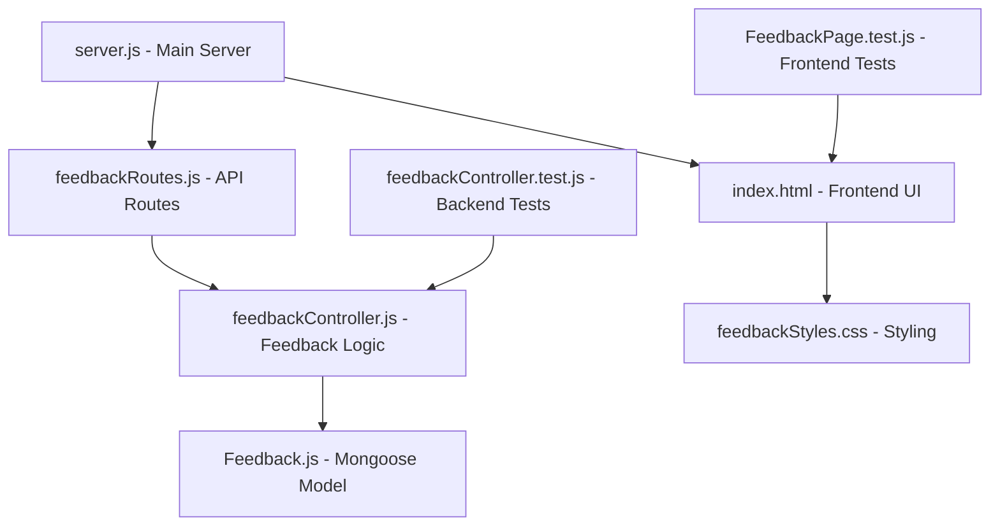

# System Architecture & Function Map

```mermaid
graph TD
    A["server.js - Main Server"]
    B["feedbackRoutes.js - API Routes"]
    C["feedbackController.js - Feedback Logic"]
    D["Feedback.js - Mongoose Model"]
    E["index.html - Frontend UI"]
    F["feedbackStyles.css - Styling"]
    G["FeedbackPage.test.js - Frontend Tests"]
    H["feedbackController.test.js - Backend Tests"]

    A --> B
    B --> C
    C --> D
    A --> E
    E --> F
    G --> E
    H --> C
```