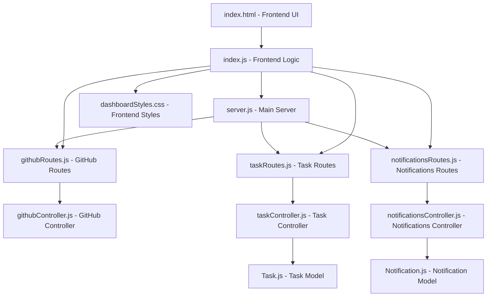

# System Architecture & Function Map

```mermaid
graph TD
    A[server.js - Main Server]
    B[githubRoutes.js - GitHub Routes]
    C[taskRoutes.js - Task Routes]
    D[notificationsRoutes.js - Notifications Routes]
    E[githubController.js - GitHub Controller]
    F[taskController.js - Task Controller]
    G[notificationsController.js - Notifications Controller]
    H[Task.js - Task Model]
    I[Notification.js - Notification Model]
    J[index.html - Frontend UI]
    K[index.js - Frontend Logic]
    L[dashboardStyles.css - Frontend Styles]

    A --> B
    A --> C
    A --> D
    B --> E
    C --> F
    D --> G
    F --> H
    G --> I
    J --> K
    K --> A
    K --> B
    K --> C
    K --> D
    K --> L
```