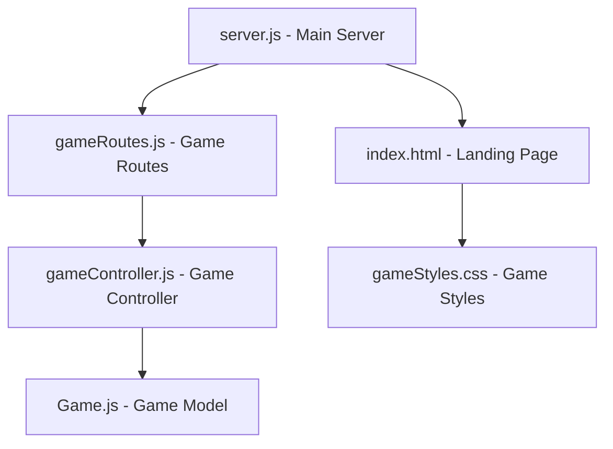

# System Architecture & Function Map

```mermaid
graph TD
    A["server.js - Main Server"]
    B["gameRoutes.js - Game Routes"]
    C["gameController.js - Game Controller"]
    D["Game.js - Game Model"]
    E["index.html - Landing Page"]
    F["gameStyles.css - Game Styles"]

    A --> B
    B --> C
    C --> D
    A --> E
    E --> F
    click A "server.js#L1" "Open server.js"
    click B "gameRoutes.js#L1" "Open gameRoutes.js"
    click C "gameController.js#L1" "Open gameController.js"
    click D "Game.js#L1" "Open Game.js"
    click E "index.html#L1" "Open index.html"
    click F "gameStyles.css#L1" "Open gameStyles.css"
```