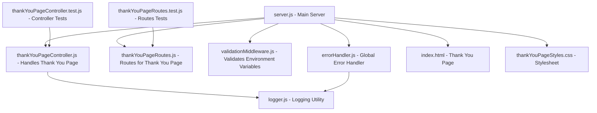

# System Architecture & Function Map

```mermaid
graph TD
    A[server.js - Main Server]
    B[thankYouPageController.js - Handles Thank You Page]
    C[thankYouPageRoutes.js - Routes for Thank You Page]
    D[validationMiddleware.js - Validates Environment Variables]
    E[errorHandler.js - Global Error Handler]
    F[logger.js - Logging Utility]
    G[index.html - Thank You Page]
    H[thankYouPageStyles.css - Stylesheet]
    I[thankYouPageController.test.js - Controller Tests]
    J[thankYouPageRoutes.test.js - Routes Tests]

    A --> D
    A --> B
    A --> C
    A --> E
    A --> G
    A --> H
    B --> F
    E --> F
    I --> B
    J --> C
```