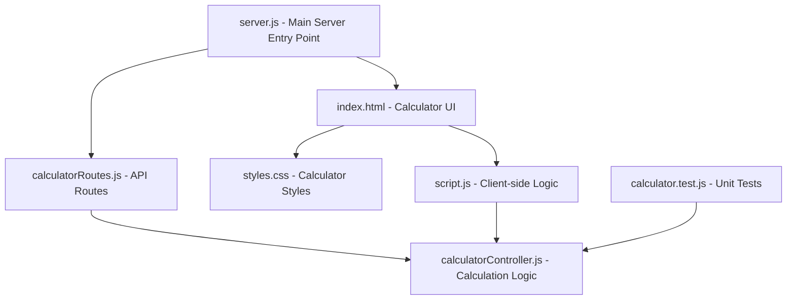

# System Architecture & Function Map

```mermaid
graph TD
    A["server.js - Main Server Entry Point"]
    B["calculatorRoutes.js - API Routes"]
    C["calculatorController.js - Calculation Logic"]
    D["index.html - Calculator UI"]
    E["styles.css - Calculator Styles"]
    F["script.js - Client-side Logic"]
    G["calculator.test.js - Unit Tests"]

    A --> B
    B --> C
    A --> D
    D --> F
    D --> E
    F --> C
    G --> C
```