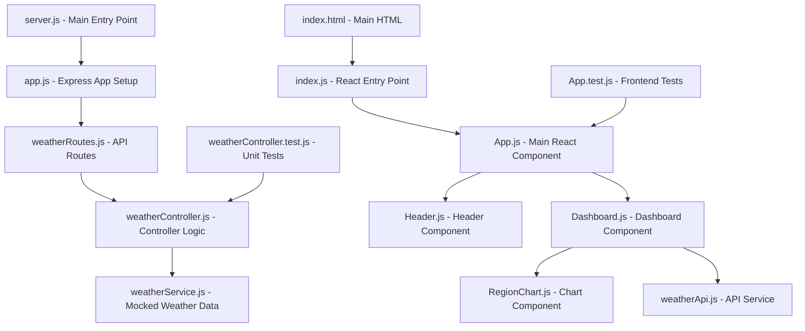

# System Architecture & Function Map

```mermaid
graph TD
    A[server.js - Main Entry Point]
    B[app.js - Express App Setup]
    C[weatherRoutes.js - API Routes]
    D[weatherController.js - Controller Logic]
    E[weatherService.js - Mocked Weather Data]
    F[weatherController.test.js - Unit Tests]
    G[index.html - Main HTML]
    H[index.js - React Entry Point]
    I[App.js - Main React Component]
    J[Header.js - Header Component]
    K[Dashboard.js - Dashboard Component]
    L[RegionChart.js - Chart Component]
    M[weatherApi.js - API Service]
    N[App.test.js - Frontend Tests]

    A --> B
    B --> C
    C --> D
    D --> E
    F --> D
    G --> H
    H --> I
    I --> J
    I --> K
    K --> L
    K --> M
    N --> I
```