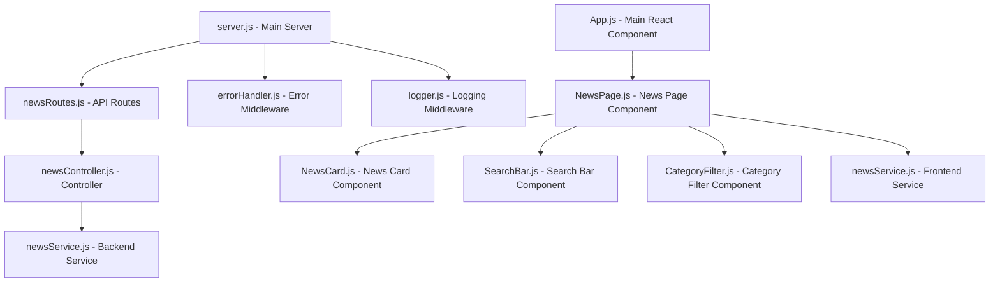

# System Architecture & Function Map

```mermaid
graph TD
    A["server.js - Main Server"]
    B["newsRoutes.js - API Routes"]
    C["newsController.js - Controller"]
    D["newsService.js - Backend Service"]
    E["errorHandler.js - Error Middleware"]
    F["logger.js - Logging Middleware"]
    G["App.js - Main React Component"]
    H["NewsPage.js - News Page Component"]
    I["NewsCard.js - News Card Component"]
    J["SearchBar.js - Search Bar Component"]
    K["CategoryFilter.js - Category Filter Component"]
    L["newsService.js - Frontend Service"]

    A --> B
    B --> C
    C --> D
    A --> E
    A --> F
    G --> H
    H --> I
    H --> J
    H --> K
    H --> L
    click A "server.js#L1" "Open server.js"
    click B "newsRoutes.js#L1" "Open newsRoutes.js"
    click C "newsController.js#L1" "Open newsController.js"
    click D "newsService.js#L1" "Open newsService.js (Backend)"
    click E "errorHandler.js#L1" "Open errorHandler.js"
    click F "logger.js#L1" "Open logger.js"
    click G "App.js#L1" "Open App.js"
    click H "NewsPage.js#L1" "Open NewsPage.js"
    click I "NewsCard.js#L1" "Open NewsCard.js"
    click J "SearchBar.js#L1" "Open SearchBar.js"
    click K "CategoryFilter.js#L1" "Open CategoryFilter.js"
    click L "newsService.js#L1" "Open newsService.js (Frontend)"
```