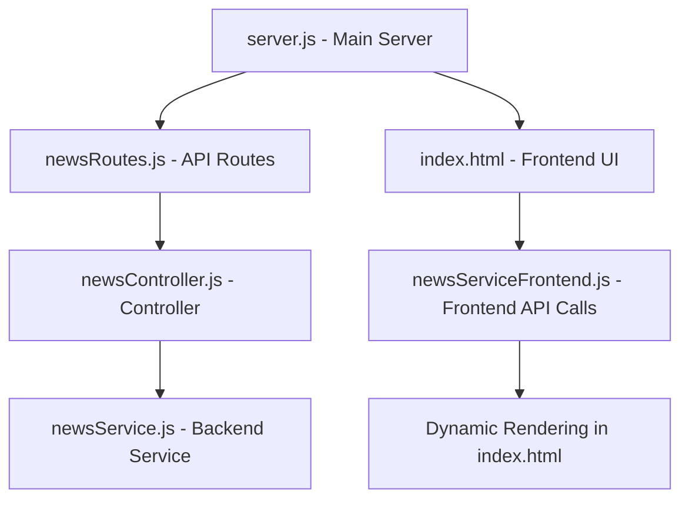

# System Architecture & Function Map

```mermaid
graph TD
    A["server.js - Main Server"] --> B["newsRoutes.js - API Routes"]
    B --> C["newsController.js - Controller"]
    C --> D["newsService.js - Backend Service"]
    A --> E["index.html - Frontend UI"]
    E --> F["newsServiceFrontend.js - Frontend API Calls"]
    F --> G["Dynamic Rendering in index.html"]
    click A "server.js#L1" "Open server.js"
    click B "newsRoutes.js#L1" "Open newsRoutes.js"
    click C "newsController.js#L1" "Open newsController.js"
    click D "newsService.js#L1" "Open newsService.js"
    click E "index.html#L1" "Open index.html"
    click F "newsServiceFrontend.js#L1" "Open newsServiceFrontend.js"
```